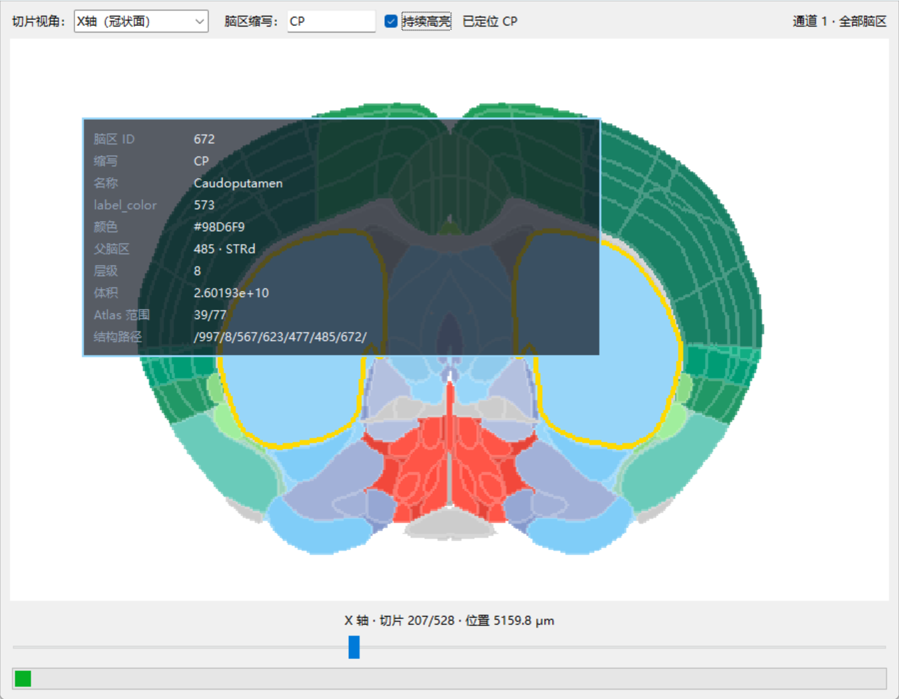

# Brain_Atlas_slice

<h4>
  This is the data of three standard sections (coronal、sagittal、Tramseverse) from the standard brain atlas.
   
   
  These tif slice images come with built-in brain region ROIs, allowing you to obtain specific brain region data based on the areas you are interested in
</h4>

---

### 📦 Data Access

<h4>
  The zip file requires a password. Please contact me directly.
</h4>

<h4>
  Thank you very much for your attention, and I appreciate your help in giving a star on the top right corner ⭐
</h4>

---

### 📮 Contact

<h4>
  Welcome to follow me on <b>RedBook (3126028326)</b>. If you have any questions, please contact me in a timely manner.
</h4>

---

### 🖼️ Demo

